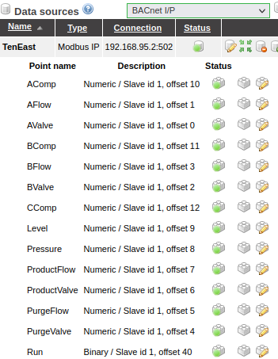
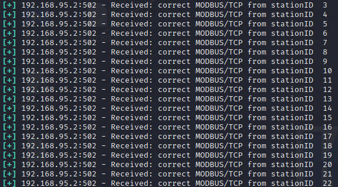
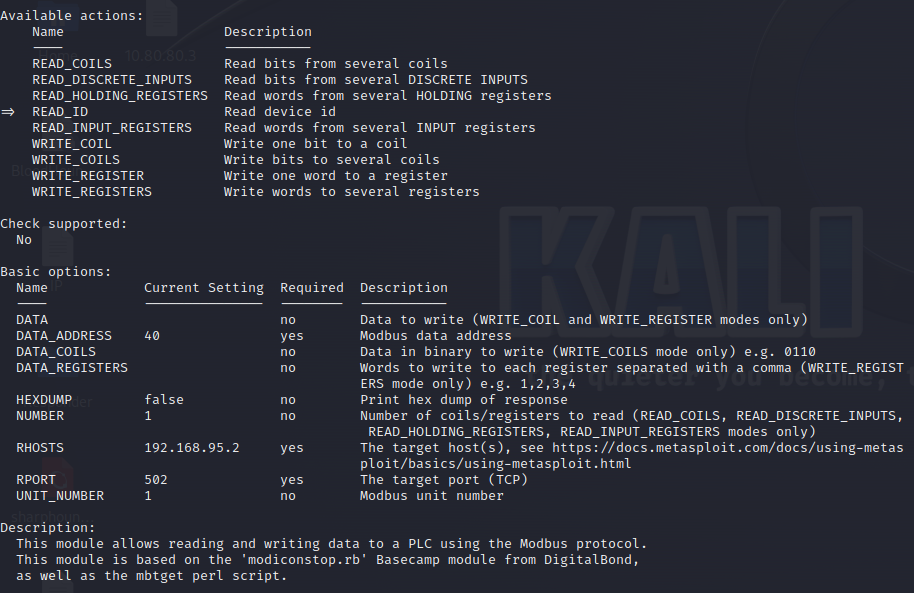

In this document I want to show what I've learned about attacking SCADAA infrastructure using [GRFICS](https://github.com/Fortiphyd/GRFICSv2) a cool Industrial Control Simulator with a graphic interface accessible via web


The simulation involve a <u>chemical process reaction</u> controlled by a **PLC** (VM with a modified version of [OpenPLC](https://openplcproject.com/)) through **<u>MODBUS</u>** protocol

<br>

GRFICS is composed by 5 Virtual Machine with the following topology


The subnet **192.168.90.0/24** is a [DMZ ZONE](https://www.fortinet.com/resources/cyberglossary/what-is-dmz) and act as a WAN containing the HMI.

The HMI is connected with the LAN ZONE (containing PLC, Workstaton and the Simulator of the Chemical Plant) through a **pfSense** firewall

<br>

# OVERVIEW

At `192.168.90.5:8080/ScadaBR/login.html` we can login to the HMI ScadaBR (credentials are admin:admin)


Clicking on the flag icon we have a list of all the alarms (like user login, system startup and shutdown, ecc...)


In the **Data Sources** we have a list of the Modbus devices (in this case I/P network)



We can also check single devices, for instance let's pick **Level**


<br>

You can check other feature by yourself but for now this is enough

<br>

# FOOTHOLD AND SNIFFING

As an attacker we are initiate our penetration from the DMZ zone s let's start with the traditional nmap scan of the network


In the RED square we have the results of the address **192.168.90.5** which is the HMI and in the YELLOW section the pfSense machine (**192.168.90.100**)

What is valuable for us is to retrieve the address of the **PLCs** in order to interract directly with it

One method is to use **arpspoof** and impersonate the HMI and obtain the PLC messages.

Just run `arpspoof [HMI_IP_ADDR]` to start the arp poisoning (note that will be necessary to use the `-t` so we can poison 1 machine at time and not all the caches around the network making less noise)


Now just open WireShark on the interface connected to the DMZ and filter the capture with `not arp` to remove ARP messages from the returned packets


We can easily check that the address **192.168.95.2** is sending a continuos flow of data and is using the **port 502** which is <u>default for Modbus protcol</u>. We can conclude that the address of the PLC is **<u>192.168.95.2</u>** and is operating on a separate subnet from the one which the attacker resides

<br><br>

## NOTE ABOUT ARP-SPOOFING

"The quiter you become, the more you are able to hear" is the mantra every attacker need to follow and this case is a good example. When we run arpspoof we are impersonating the HMI and every message direct to it is actually sent to the attacker, the issue here is that HMI is not receiving what it is expecting and can make victims suspicious.

To avoid that we can use the `-t` flag (with _arpspoof_) so we can poison 1 machine at time and not all the caches around the network making less noise.

Also with root privileges run `echo 1 > /proc/sys/net/ipv4/ip_forward` so we can tell the kernel to enable port forwarding which is disabled by default for security reasons (keep in mind disable it after you have done your job). In short we are telling the machine "if you know where this messages belong to send it there" so we send the intercepted message to the victim  


## METASPLOIT MODULE FOR SCADABR
Since the HMI is ScadaBR we can use a METASPLOIT module at `admin/http/scadabr_credential_dump` in order to get SHA1 hash of the passwords of every users and service


We use the default credentials `admin:admin`, set the RHOST with the IP of the ScadaBR HMI and run the module


This output is really poor but if there are more than one users and different services (like SQL for the collected data) gaining the hash can be really rewarding if the password is weak enogh to be cracked in a relative short amount of time

Metasploit have a different module for different HMI and protocol so a good enumaration is needed to check if some known vulnerability (ex:/ buffer overflow which is really common on HMI) and save precious time

<br>


# INTERRACT WITH MODBUS
We need to make our first step inside the <u>operational network</u> (**192.168.95.0/24**) where our PLC and Workstation reside.

The easiest way is to manually set a static IP address with a costum route to the operational network using the ip address of pfsense as gateway


Remember that for a real pivoting you need first to comproomise or impersonating a legittim resource with right privilege on the DMZ network

Now we can interract with the PLC directly making different action starting from the enumaration. As first let's use some metasploit module which are really helpfull, easy-to-use and clean results

<br>

### MODBUS DETECT


This should be the first module to launch because it detects the specific Modbus service used by the target PLC (even more than 1) checking the header of specific unitID (default 1 but keep in mind every installation could have some closed ID)


In this case we know that the PLC is running **MODBUS/TCP** on port 502

 <br>
 
 ### MODBUS FIND UNIT_ID


This module check for the station ID (from 1 to 254) present on the network. This is essential if we want to manipulate and abuse the Modbus protocol.



In this example all ID are used unless the number 218


Keep in minf that this results are not reliable as  you may think, some "closed" station can be in use but somehow (like some defense measure) they are returned as not in use 

<br>

### MODBUS CLIENT
This is pretty cool, it's what allows attackers to interract with the PLC directly.

The definiton of "interaction" about PLC is **<u>reading and writing both register and coils</u>**, with the right knowledge this can be fatal and make huge damage to the industrial system (in this case the chemical plant)



We have two important options to set :
* **DATA_ADDRESS** = modbus data address to interract with
* **RHOSTS** = the target(s) of the module
* **UNIT_NUMBER** = Modbus unit targeted (default 1)
* **NUMBER** = # of register/coils to act (default 1)

<br>

What is important here are all the different action the attacker can do on **coils** and **register** (check the table of the groups to understand which table store what)

Let's change the **number** to 50 so we can read more coils/register at once (reading from unitID 1 and read 50 register/coils)

Let's start with the **<u>Holding Registers</u>**


Now try with the **<u>coils</u>**


**<u>Input Registers</u>**


Same thing can be done with **<u>Discrete Inputs</u>** and are all 0

<br>

Obviously we can do the same thing but for writing and not reading, I'm gonna try something potentially bad and write 1 to the first 12 coils and see what happen (luckly nothing happened lol)


Let's try the same things but with the registers (the first 5) writing the data 50 (for writing in the registers we mean ADD the value we provide) 


<br><br>

We can use some **python libraries for modbus** to read and write coils/registers. This is an example using the `pymodbus` library

```
import time
from pymodbus.client import ModbusTcpClient as ModbusClient

client = ModbusClient("192.168.95.2", port=502)
client.connect()

while True:
    print(f"================================================================================================================\n")
    print("Coils:    ", client.read_coils(0,10, unit=1).bits)
    print("Discrete: ", client.read_discrete_inputs(0,10, unit=1).bits)
    print("Holding:  ", client.read_holding_registers(0, 10, unit=1).registers)
    print("Input:    ", client.read_input_registers(0,10, unit=1).registers)
    print(f"================================================================================================================\n")
    time.sleep(1)
```

This is usefull because you can read in real-time the data inside the PLC with a timeline and with some modification at teh code even log the output on a file. Sam thing can be done but writing on the coils/registers

<br><br>

Let's try to make some pratical usage of what I learned until now writing on a specific coil or register and make some consequence. I am still learning so I will check the **HMI** to know how the things works under the hood

(in the future I will learn how to understand what register/coil does what without interract directly with the HMI but is not irrealistic that an attacker can have access to the HMI) 


The **numeric** (holding registers) and **binary** (coils) are used as shown above

Let's focus on the **coil number 40** which apparently is used to start/stop the chemical plant which is active by default

Now let's use **modbusclient** and read the the content of this specific coil with **READ_COILS**  as action and 40 as **DATA_ADDRESS** 


Now we know that when the chemical plant is active the coil number 40 is equal to 0. In order to stop th plant we need to change this to the value 1

Change the action to **WRITE_COIL** and **DATA** to 1 and hit runs


Now look at the HMI and we can check that we have succesfully stopped the chemical plant (look at the stop red-light)


<br><br><br>


## PLC LOGIC AND MALICIOUS PROGRAM

Assuming we get access to the workstation machine and we can check the contents of the files containing the **logic flow of the PLC**


This is the main and is a Block Diagram and below we have all the variables (if you have enough luck in attack assestment you can find description of every variable)


Which should get your attention here is the `initialize_sp`


This is cool look at the tab above we have 2 types of variables **local** (constant / sp = set point) and **output**. The diagram below just assign at the output variable the corresponding local variable.

The **output variables** are the one <u>used in the main program</u> so this is really juicy especially the **press_sp_c** because control the (as the name suggest) the pressure inside the tank of our chemical plant. If is too much well...it can explode

The **GRAFICS** simulator gave us a ready to use code which can be implemented and broke the chemical plant 
Is the same implementation but the highest value possible is assigned at every variable


Now just press the **Generate Program for OpenPLC Runtime** button to compile the diagram block into C code.


We need to save this on a **.st** file (Structured Text) designated for PLC. This standard is higly used on **[CoDeSys](https://en.wikipedia.org/wiki/CODESYS)** a development enviroment for PLC and programming controller.
CoDeSys main application are IDE for PLC programming

Return to our malicious PLC code uploading after we saved it we have to connect to the **OpenPLC Server** page


Now just upload the programm with the default section and press **UPLOAD**.
When the programm is successfully compiled you can see the consequence of an attacker with enough access on a workstation and PLC server


This is was just a simple-use-case of a unprotected ICS enviroment used as first training round to get some confidence with the attacking tools, packet inspection, PLC manipulation and malicius PLC code injection! 
