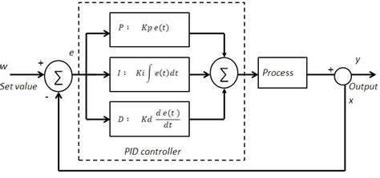

If you wanna hack SCADA/ICS you need to understand PLC and to understand PLC you need to understand how this little (but powrfull) guys are programmed.

**<u>Ladder Logic</u> (LL)** is the most common language used in PLC especially Industrial Control an Automation systems. The real difference from other language is that LL use graphical symbol instead of lines of code. Let's dive in!

<br>

## <u>MAIN COMPONENTS</u>


A LL is "written" with the use of **Ladder Diagram** used to draw conditional and cycle using **symbols**

* **<u>Left/Right power Rail</u>**
They simulate the power suplly lines used by the entire diagram. Right is the "hot" line (**+V**) while the left is usually the ground (**0V**)

<br>

* **<u>Ladder Rung</u>**
The horizzontal line of the ladder diagram which function is to rappresent a **logical operation or control flow** using input and conditional. Usually the result of this flow is the control of outputs

<br>

* **<u>Branch</u>**
Is a section of the diagram that "branches" from the main rung for alternative control paths or organization of the flow based on certain conditions

<br>

The inputs on a ladder logic programm ar called **<u>contacts</u>** which are **HARD (physical) inputs**, rappresented by a single bit, coming from physical devices connected to the PLC (like buttons)

Opposite the outputs of a rung are the **<u>coils</u>** usually placed at the far right near the left rung. Similar to contacts they represent a physical output connected to the PLC

<br>

We have another important "invisibile" components in PLC logic : 
* **Scan Cycle** = when the PLC check the inputs, execute the program and update the outputs makes <u>one</u> cycle
* **Scan Time** = the amount of time a PLC make a single cycle


<br><br>

# SYMBOLS
The [PLCopen Organizzation](https://plcopen.org/) made the standard for Ladder Logic Diagram for a general understanding of the code. What's more important are the **symbols** that are instruction to implement in the diagram. Here's the symbol list with a definition of the correlated instruction

<br>

## <u>NO</u> (normally open)


Normall used to check/define **PLC input** through a conditional instruction. If a bit is on the symbol return true and false otherwise.

This symbol is associated with an address so it knows where to read and check the bit (can be a inputbut also an internal register of the PLC). If the bit is ON the contact will be CLOSED (and the rung is activated) otherwise will be open and the rung is disactivated

<br>

## <u>NC</u> (normally closed)


Like the **NO** symbols but with an opposite behaviour if the bit is ON the contact will be OPEN (blocking the flow) and CLOSED otherwise

<br>

## <u>(OUTPUT) COIL</u>


Coils are linked with the memory address where the output (TRUE/FALSE) will be stored based on the input condition.

If the input is TRUE the output is 1 otherwise is 0

<br>

## <u>(OUTPUT) NEGATED COIL</u>


Opposite output of the standard coil

<br>

## <u>POSITIVE EDGE DETECTION COIL</u>


The nickname for this guy is **one-shot** symbol. When the input is TRUE the output will be 1 <u>just for a single PLC cycle</u>, the image below will make a better explanation  


<br>

## <u>NEGATIVE TRANSITION-SENSING COIL</u>


Like the Positive Edge Detection Coil but opposite behaviour

<br>

## <u>SET LATCH COIL</u>


Like a normal coil but when is set to 1 stays on even if the input switch to FALSE

<br>

## <u>RESET COIL</u>


When input is TRUE the output is (re)set to 0 if FALSE no effects.
When the output as been reset one time and not changed from other coil even if the input is TRUE th output stays at 0 


<br>

## <u>TIMER DELAY ON</u>


When the input is TRUE the timer start and when the `preset` amount of time expire the output is set to 1.
When the input goes to FALSE the timer stops and output goes back 0


<br>

## <u>TIMER DELAY OFF</u>


Similare to the timer delay on, when input is TRUE the output goes directly to 1 and when the input goes back  to FALSE the output stays at 1 and the preset timer start. Only when the timer expire the output goes back to 0 

<br>

## <u>COMPARISON AND MATH SYMBOLS</u>


<br>

## <u>UP/DOWN COUNTER</u>


When the input i set to TRUE the counter increment/decrease of one value. When the preset value is reached (or reach 0 in case of down counter) the output is set to 1 resetting the counter


<br>

## <u>PID CLOSED LOOP CONTROLLER</u>



This is the hardest symbol to deeply understand cause use some mathematics functions but the purpose is really simple take a look at this simple schema below which represent the procedure to set the temperature of a oven


This is a simple **closed loop** where the PID controller is responsible to make the oven reach the temperature exactly at the input value setted by the user. But how can this happen?

Thanks to **<u>PID equation</u>** which is the sum of 3 components :

* <u>**P**roportional</u> (gain) = corrective action based on the error
* <u>**I**ntegral</u> (reset) = corrective action based on integral sum of errors over time
* <u>**D**erivatie</u> (rate) = corrective action based on the change of the errors

This is a the basic understanding of this symbol which is really powerfull for different type of approach

<br><br>

# QUICK EXAMPLES

This symbols need to be concatenated togheter on every ladder to create a **logic flow**. At first sight can seems hard and caothic but with the right knowledge in boolean logic and behaviour of every simbol can be more easy than expected. I'm gonna use this [online simulator](https://app.plcsimulator.online/) to creat some simple pratical example of ladder logic diagram 

<br>

## EXAMPLE 1

Let's start with the "hello world" of PLC ladder logic programming, every rung start with a contact and end with a coil 


Let's write this in pseudocode
```
AA = True
BB = AA
```

Simple right? If the contact have value 1 (true) the logic flow continue and reach the coil setting the value linked with it to 1


Otherwise the flow will stop when "touch" the contact


<br>

## EXAMPLE 2

What if we wanna make this piece of pseudocode?

```
BB = AA & CC
```

Here we need 2 contacts on the same rung (doesn't matter in which order) linked respectevly with AA and CC and the usual coil linked with BB at the end of the rung


Easy and smooth right? Now the flow will reach the coil if and only if both AA and CC are set to TRUE 


otherwise the flow will block and BB will set to false


<br>

## EXAMPLE 3
```
BB = AA | CC
```

This is the code for a simple boolean OR and we will use this example to introduce the **branch**


NOw the flow is exactly like a logic OR functions the flow will reach the coil if one (or both) of the connector are set to True


<br>

You can now try to use NC contact to make NAND and NOR the foundamental is understand how a diagram works with the right experience we can add some counter, comparison and mathmeatical operator and mix them togheter

For a more complex and pratical example youcan take a look at the [Conveyor Simulator](https://app2.codingplc.com/)

<br><br>

Here's one simple example which can be made with **Ladder Logic**


Assuming we have 2 bottons : START and STOP linked to a MOTOR, when start is pressed (and stop is not pressed) will start the motor after 3 seconds thanks to the TIMER and light up the green light.
As soon as we prss the STOP button the motro will stop and the red light will set to on (closing the green one), even if the START button is pressed until STOP is set to TRUE the flow will not allow the motor to start!

Think as an attacker, we can force the red light to be on writing on the right coil but set false to stop so the motor will contnue to work but the operator will see the red light. Another attack can replace the logic diagram with a malicious one making the understnading of **Ladder Logic** a foundamental weapon in your skillset
