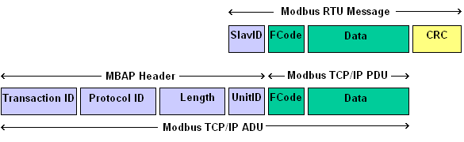
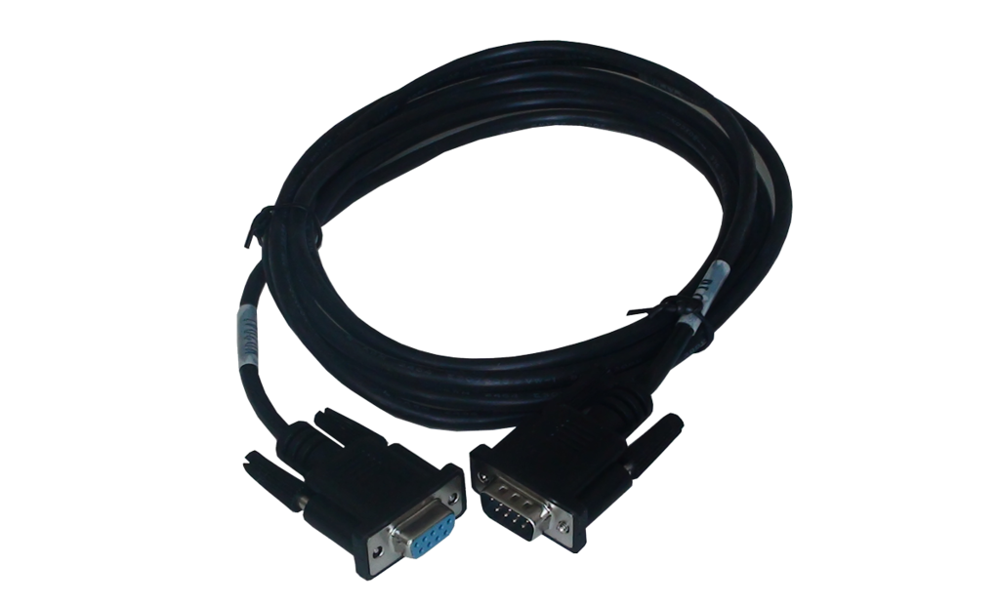

SCADA/ICS INTRODUCTION

**Supervisory Control and Data Acquisistion** (SCADA) is a **ICS** (Industrial Control System) that allows, in the context of an industrial organization to :
- <u>Control industrial process</u> (locally or remotely)
- <u>Retrieve, monitor and rappresent data in real-time</u>
- <u>Interract with hardware</u> (like sensors, valves, pumps and motors)
- <u>Records events</u> in log files

SCADA is used in a wide range of industrial sectors both public and private (power, recycling, water, manufacturing, ecc...) in order to enhance **efficency, productivity and maintainance controll** of the industrial process and machine in a safer way thanks to the **remote control and automation** provided by the SCADA subsystem.

Also is highly scalable and can integrated with other system such ERP (Enterprise Resources Planning) or manegment system to increase coordination and automation
   
# ARCHITECTURE
SCADA works with his own architecture that need to be embeeded with the industrial process and machine to work properly. This are the main components which SCADA is based on :

1) <u>**RTU**</u> = <u>Remote Terminal Unit</u> (RTU) are used to <u>interface field device with SCADA</u> and control equipments remotely (eg:/ open or close valves). Also support multiple communication protocol at the same time (while the number of I/O are limited). One of the main function is to use it as <u>protocol converter</u> (eg:/ ModBus to DNP3) and <u>collect telemetry data</u>

2) <u>**PLC**</u> = <u>Programmable Logic Controller</u> (PLC) is similar to RTU but have some technical and design difference (also PLC are predominant but RTU are used for control). PLC are used to <u>control a process with the execution **pre-programmed logic**</u> (converting sensor signals in digital data) which handle the decisions of a specific task. Also PLC can interract directly with field equipment accepting command directly from the user and <u>implements form of redundancy</u> to increase fault tollerance

3) <u>**HMI**</u> = Human Machine Interface (HMI) is essentially a I/O device and category of softwares which <u>present the data</u> (pre-collected and pre-processed) and <u>let the operator control the process</u>. This component is the base to improve efficency, productivity and retrieve (critical) data faster thanks to graphics and compare real-time data with the histories. Also can be accessed remotely.

4) <u>**Supervisory Computer**</u> = This is the core of SCADA is a computer which is responsible for communicating with the field controllers (PLC/RTU) and includes HMI running on the workstations. This PC check the overall situaton of the field (not necessary each controller). They are also used in <u>distributed application</u> and <u>disaster recovery sites</u>.
5) <u>**Communication Infrastructure**</u> = Structure that connect supervisory computers with the PLC/RTU and is a focal point on the the development planning. Can use proprietary or standard protocol and must include <u>fault or fail solution</u> (redundacy, double cable, ecc...). The legacy of SCADA was based on **MODBUS** which is widely used in modern application for is semplicity and robust design.
ModBus is a <u>request-response using master-slave protocol</u> where only the maste can initiate commands and the slave should respond, the PDU is based on a 1 byte function code (which is the first thing checked by the operational unit) and 252 non-function-specific data

  

Modern implementations of SCADA can allow user and operator to interface with the HMI through the network and web interfaces (which is one of the main attack vector). **IGNITION** is one of the most used software since 2010.

   

# PROTOCOLS
SCADA/ICS pentest have some really focal differences starting with the protocols, there are more than 100 protcols <u>some of them are **open** other are **proprietary**.</u>

Here is a brief description of the widely used protocols in industrial systems, keep in mind that **PLC can support different protocols** but most of the times are designed to use 1 or 2 specific ones.

  

#

## <u>MODBUS</u>
Is the **de-facto standard** of the field. Is easy to implement and simple to understand making it widely used on different context

The wire used is **RJ-485 family** connector (common one is RJ45, image below) with <u>shielded twisted-pair cable</u>

The protocol include nodes (<u>master</u> or <u>slave</u>) connected on the network using a **request/reply** model (operating on layer 7 of OSI stack). Every node have a unique address.

Is simple, lightweight (max PDU size is 255 bytes) and modular because nodes can communicate with **different baud rates and data formats**

2 version of modbus :
* **Serial** (ASCII or RTU)
* **Ethernet** (TCP) &#8594; <u>mbap</u> protocol (port 502)
  
&nbsp;&nbsp;&nbsp;&nbsp;&nbsp;&nbsp;&nbsp;&nbsp;&nbsp;&nbsp;&nbsp;&nbsp;&nbsp;&nbsp;&nbsp;&nbsp;&nbsp;&nbsp;&nbsp;&nbsp;&nbsp;&nbsp;&nbsp;&nbsp;|&#8594; `TransID + ProtocolID + Length` (7 bytes)

&nbsp;&nbsp;&nbsp;&nbsp;&nbsp;&nbsp;&nbsp;&nbsp;&nbsp;&nbsp;&nbsp;&nbsp;&nbsp;&nbsp;&nbsp;&nbsp;&nbsp;&nbsp;&nbsp;&nbsp;&nbsp;&nbsp;&nbsp;&nbsp;|&#8594; <u>Gateway</u> are used to intercept TCP/IP request and passes to the serial channel

<u>Function Codes</u>

  

**<u>PDU FORMAT</u>**
The PDU differ from RTU and TCP/IP

  
 
 **<u>SLAVE</u>**
 Slave store data in **2 different groups of tables with 2 tables each** (read/only and write/only)
 
 * <u>Discrete</u> (COILS) &nbsp;&nbsp;&nbsp;&nbsp;&nbsp;&nbsp;&#8594; 1 bit
 * <u>Analog</u> (REGISTER) &nbsp;&nbsp;&#8594; 16 bits 

This table separation is obviously logical, the systems use offsets to recognize on which table is operating

Even if seems obvious <u>COILS are used for ON/OFF states</u> on devices and <u>REGISTER to store values</u> like temperature or pression

 

**<u>Security Issues</u>**
* No (or weak) authentication
* No encryption
* No checksum (spoofing)
* No broadcasting suppression (really easy to DoS)

  

#
## <u>Distributed Network Protocol 3.0</u> (DNP3)
DNP3 is a set of communication protocol used mainly in **electric** utilities but also oil, gas, water and waterwaste and use <u>TCP/IP port 2000</u>.

Like MODBUS, DNP3 use RJ-485 connectors but implements also **<u>Fiber Optic</u>**

<u>**PROs**</u>
* **Resistance to EMI interference** (frequency hopping, retransmission and error detection)
* Works good on low nad heterogeneous mediums and data types
* 65k nodes on same link
* Suitable and designed for <u>Telemetry, Alarming and Remote Control</u> 
(time-synch and timestamp based event)
* Multiple Control Center

The main difference from <u>MODBUS</u> are 
1) Client (slaves) can send **unsolicited response** (for different reasons)
2) **Report By Exception**, to improve efficency the slaves communicate only when there is a change on data which the slave is responsible for (is one important point in malware)

 

The **PDU** is designed as the following image (look at the start bytes) and use Function Code in the same way as MODBUS

<u>Function Codes</u>

  

#
## <u>PROFINET / PROFIBUS</u>

This 2 protocols are designed and widely used in automation, manufacturing and building automation (lights, door, ecc...) and was developed by **Siemens** and now maintained by **PI** (<u>Profinet & Profibus International organization</u>).

The standard cable and connectors are described here 

|         | Cable           | Connector  |
| ------------- |:-------------:| -----:|
| **PROFINET**     | Ethernet | RJ-45 |
| **PROFIBUS**      | RS-485      |  DB9  |

   

This is the **RS-485** cable

And this is the **DB9** connector (male and female)

  

<u>**PRO**cess **FI**eld**BUS**</u>
* <u>BI-DIRECTIONAL</u> protocol
* Data can be <u>analog</u> or <u>discrete</u>
* Master are identified with a **token sharing** mechanismin order to communicate with the slave
* **<u>MASTERS are PLC/RTU</u>** and **<u>SLAVES are sensors, motors,actuactors</u>** (ecc...)

 

PROFIBUS have <u>different **sub-types**</u> to get in touch easly with different application/context 

1) <u>PROFIBUS **DP</u>** &#8594; **D**ecentralized **P**eriphery (most common)

&nbsp;&nbsp;&nbsp;&nbsp;&nbsp;&nbsp;&nbsp;&nbsp;&nbsp;&nbsp;&nbsp;&nbsp;&nbsp;&nbsp;&nbsp;&nbsp;&nbsp;&nbsp;&nbsp;&nbsp;&nbsp;&nbsp;&nbsp;|&#8594; Simpler and Faster  

&nbsp;&nbsp;&nbsp;&nbsp;&nbsp;&nbsp;&nbsp;&nbsp;&nbsp;&nbsp;&nbsp;&nbsp;&nbsp;&nbsp;&nbsp;&nbsp;&nbsp;&nbsp;&nbsp;&nbsp;&nbsp;&nbsp;&nbsp;|&#8594;  <u>DP-V0</u> = Cyclic data exchange (small, single-master app)

&nbsp;&nbsp;&nbsp;&nbsp;&nbsp;&nbsp;&nbsp;&nbsp;&nbsp;&nbsp;&nbsp;&nbsp;&nbsp;&nbsp;&nbsp;&nbsp;&nbsp;&nbsp;&nbsp;&nbsp;&nbsp;&nbsp;&nbsp;&nbsp;&nbsp;&nbsp;&nbsp;&nbsp;<u>DP-V1</u> = Acyclic Data Exchange (large, multi-master app)

&nbsp;&nbsp;&nbsp;&nbsp;&nbsp;&nbsp;&nbsp;&nbsp;&nbsp;&nbsp;&nbsp;&nbsp;&nbsp;&nbsp;&nbsp;&nbsp;&nbsp;&nbsp;&nbsp;&nbsp;&nbsp;&nbsp;&nbsp;&nbsp;&nbsp;&nbsp;&nbsp;&nbsp;<u>DP-V1</u> = Isochronus slave-to-slave mode (real-time app)

3) <u>PROFIBUS **PA**</u> &#8594; **P**rocess **A**utomation
   
&nbsp;&nbsp;&nbsp;&nbsp;&nbsp;&nbsp;&nbsp;&nbsp;&nbsp;&nbsp;&nbsp;&nbsp;&nbsp;&nbsp;&nbsp;&nbsp;&nbsp;&nbsp;&nbsp;&nbsp;&nbsp;&nbsp;&nbsp;|&#8594;  Standard process of data trasmission

&nbsp;&nbsp;&nbsp;&nbsp;&nbsp;&nbsp;&nbsp;&nbsp;&nbsp;&nbsp;&nbsp;&nbsp;&nbsp;&nbsp;&nbsp;&nbsp;&nbsp;&nbsp;&nbsp;&nbsp;&nbsp;&nbsp;&nbsp;|&#8594; Designed for <u>HAZARDOUS enviroment</u> with **M**ulti **B**us **S**ystem  
&nbsp;&nbsp;&nbsp;&nbsp;&nbsp;&nbsp;&nbsp;&nbsp;&nbsp;&nbsp;&nbsp;&nbsp;&nbsp;&nbsp;&nbsp;&nbsp;&nbsp;&nbsp;&nbsp;&nbsp;&nbsp;&nbsp;&nbsp;&nbsp;&nbsp;&nbsp;&nbsp;&nbsp;&nbsp;(less power = less spark or explosion chances)

  

<u>**PRO**cess **FI**eld **NET**</u>

PROFINET is designed for <u>scalability</u> and work with ethernet (that's different from  profibus over ethernet !!!).

Is designed to receive data under **time constraint** and use **TCP/IP** and **XML** as communication

**<u>FUNCTION CLASSES</u>**
 * **I/O** &nbsp;&#8594; <u>RealTime Channel</u> (cycle times 10ms)
   
&nbsp;&nbsp;&nbsp;&nbsp;&nbsp;&nbsp; |&#8594; <u>Non RealTime Channel</u> (cycle times ~100ms)
* **IRT** &#8594; Cycle 1ms
  
&nbsp;&nbsp;&nbsp;&nbsp;&nbsp; |&#8594; Non routable (works only on Layer 1-2)
* **CBA** &#8594; Distributed Industrial Automation Application
  
&nbsp;&nbsp;&nbsp;&nbsp;&nbsp;&nbsp;&nbsp; |&#8594; **DCOM** and **RPC**

  

Both Profinet and Profibus are integrated togheter with PROXY

